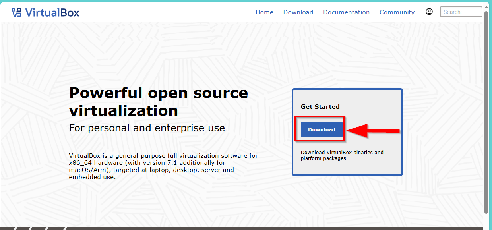

# How to Install Ubuntu (Step by Step)

### Lab Objective:

The objective of this lab is to install Ubuntu 22.04 LTS on a VirtualBox virtual machine. By the end of this lab, you will understand how to set up and configure a virtual machine to run Ubuntu 22.04 as a guest OS.

### Skills Learned:

- Downloading and configuring VirtualBox for virtualization.
- Creating and configuring a virtual machine (VM).
- Installing Ubuntu 22.04 on a VM.
- Basic understanding of Ubuntu OS setup.

### Tools Used:

- **VirtualBox**: Virtualization platform for creating and running virtual machines.
- **Ubuntu 22.04 ISO**: Installation file for the Ubuntu operating system.
- **PC**: A physical machine with Windows, macOS, or Linux operating system.

---

### Step-by-Step Instructions

### Prerequisites:

- A computer with at least 4GB of RAM and 20GB of free disk space.
- Internet connection to download VirtualBox and Ubuntu ISO.
    
    ---
    

### Step 1: Download VirtualBox

- **Go to VirtualBox Website**:
    
    Navigate to the [VirtualBox official website](https://www.virtualbox.org/) and click on “Download.”
    
    
    
- **Download VirtualBox**:
    
    Select your operating system (Windows, macOS, or Linux) and download the installer.
    
    
    
- **Install VirtualBox**:
    
    Once downloaded, run the installer and follow the on-screen instructions. Stick with the default settings for installation.
    
    
    

<aside>
💡

- How to install VirtualBox (Step by Step)?
</aside>

---

### Step 2: Download Ubuntu 22.04 LTS ISO

- **Go to Ubuntu's Website**:
    
    Navigate to the [Ubuntu downloads page](https://ubuntu.com/download/server). Once there, scroll down to the “Alternative Downloads” section.
    
    
    
- **Select Ubuntu 22.04 LTS and Download**:
    
    On the "Alternative Downloads" section, navigate to "Previous releases" and locate version 22.04.5 LTS. Click on the download link to save the ISO file to your computer.
    
    
    

---

### Step 3: Create a New Virtual Machine in VirtualBox

- **Open VirtualBox**:
    
    Launch VirtualBox after installation.
    
- **Click "New"**:
    
    Click the "New" button in the toolbar to create a new virtual machine.
    
    
    
- **Provide Name and Operating System Type**:
    - **Name**: Enter a name like "Ubuntu 22.04".
    - **Type**: Select "Linux".
    - **Version**: Choose "Ubuntu (64-bit)" from the drop-down menu.
    
    
    
- **Set Memory Size**:
    
    Set the memory size. For Ubuntu, it's recommended to allocate at least **2048 MB (2 GB)** of RAM (more if your host machine has more resources).
    
    
    
- **Create Virtual Hard Disk**:
    
    Select "Create a virtual hard disk now".
    
    
    
- **Specify Size of Hard Disk**:
    
    Set the size of the virtual hard disk. Allocate at least **20 GB** (adjust as per your needs), and click Next.
    
    
    
- **Review and Finalize VM Configuration**
    
    After configuring the settings, you'll see a summary table displaying the configuration of your new virtual machine. Review the details to ensure everything is correct, then click "Finish" to complete the VM setup process.
    
    
    

---

### Step 4: Configure the Virtual Machine for Ubuntu Installation

- **Select the VM**:
    
    From the VirtualBox main window, select your newly created VM (e.g., "Ubuntu 22.04").
    
    
    
- **Click "Settings"**:
    
    Click the "Settings" button in the toolbar to configure the virtual machine.
    
    
    
- **Set System Settings**:
    - Under **System > Processor**, increase the number of CPUs to at least **2** if your host machine allows it.
    
    
    
- **Storage Settings**:
    - Under **Storage**, click on the "Empty" CD/DVD icon under the "Controller: IDE" section.
    
    
    
    - On the right, click on the "CD icon" and choose "Choose a disk file…".
    
    
    
    - Browse and select the Ubuntu 22.04 ISO file you downloaded earlier.
    
    
    
- **Network Settings**:
    - Under **Network**, ensure "Attached to: NAT" is selected (default).
    
    
    
- **Click OK**:
    
    Once these settings are configured, click **OK** to save.
    
    
    

---

### Step 5:

- **Start the Virtual Machine**:
    
    From VirtualBox, select your VM and click **Start**.
    
    
    
- **Boot from ISO**:
    
    The VM will start, and the Ubuntu installer should load from the ISO file.
    
    
    
- **Choose Install Ubuntu**:
    
    Once the installer loads, choose "Try or Install Ubuntu" and hit Enter.
    
    
    
- **Select your Language**:
    
    Select your language (default is English) and hit Enter.
    
    
    
- **Updates and Other Software**:
    
    Choose "Continue Without Updating" as we want to install Ubuntu 22.04 and hit Enter.
    
    
    
- **Configure Keyboard**:
    
    Select your keyboard layout and Variant (default is English). With “Done” selected, hit Enter.
    
    
    
- **Configure Ubuntu**:
    
    Select "Ubuntu Server". With “Done” selected, hit Enter.
    
    
    
    When prompted for Network Connections, Configure Proxy, and Configure Ubuntu Archive Mirror, simply select "Done" and press Enter for each option. We will be using the default settings throughout this process.
    
    
    
    
    
    
    
    On the Guided Storage Configuration screen, navigate using the arrow keys to highlight "Done" and press Enter to proceed.
    
    
    
    On the storage configuration screen, review the settings, then press Enter to select "Continue". When prompted to confirm the destructive action, select "Continue" again and press Enter to proceed with the installation.
    
    
    
    
    
- **Create User Account**:
    
    Enter your name, a server name, username, and password. Click **Done**.
    
    
    
- **Complete Installation**:
    
    On the upgrade to Ubuntu Pro screen, we will choose Skip for now and hit continue as we aim to install Ubuntu 22.04 LTS.
    
    
    
    On the SSH Setup screen, check “Install OpenSSH server” to enable secure remote access
    
    
    
    On the Featured Server Snaps screen, use your arrow keys to navigate to "Done" and press Enter to proceed with the installation.
    
    
    
    The installation process will now begin. Ubuntu will be installed on your virtual machine, which may take several minutes to complete. During this time, you can monitor the progress on the screen.
    
    
    
- **Reboot**:
    
    Once the installation completes, click **Reboot Now** and remove the installation medium when prompted (VirtualBox will do this automatically).
    
    
    
    If you encounter a "Failed Unmounting /cdrom" error, simply press Enter to continue with the reboot process. This error is common and does not affect the installation.
    
    
    

---

### Step 6: Post-Installation Setup

- **Log in to Ubuntu**:
    
    After rebooting, you'll reach the Ubuntu login screen. Enter your password to log in.
    
    
    
- **Install Guest Additions**:
    
    For better performance, screen resolution, and integration between your host machine and the VM:
    
    - In VirtualBox, click **Devices** > **Insert Guest Additions CD image**.
    - Follow the on-screen prompts to install Guest Additions in Ubuntu.
- **Update the System**:
    
    Open the terminal in Ubuntu and run the following commands to update the system:
    
    ```bash
    sudo apt update
    sudo apt upgrade
    
    ```
    
    
    
    
    

---

### Conclusion:

You have successfully installed Ubuntu 22.04 on VirtualBox. You can now explore the Ubuntu operating system, run applications, and experiment with its features in a virtual environment.